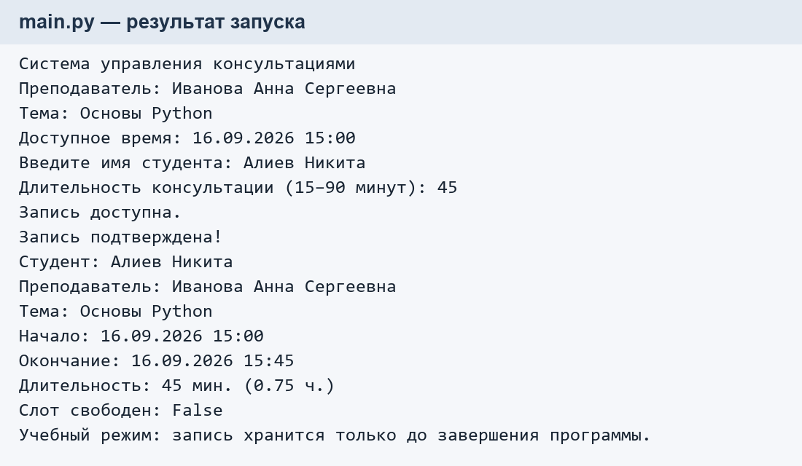
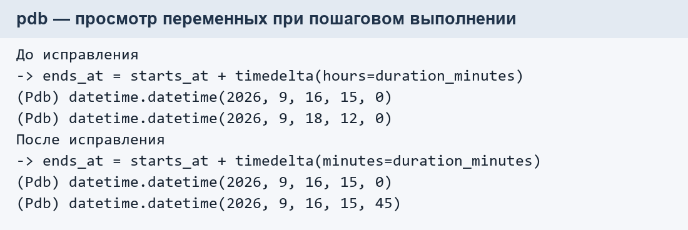

# Технологии разработки приложения на базе фреймворков

## ПРАКТИЧЕСКАЯ РАБОТА № 1

**ОСНОВЫ PYTHON: АКТУАЛИЗАЦИЯ ЗНАНИЙ И НАСТРОЙКА РАБОЧЕГО ОКРУЖЕНИЯ**

**ЭФБО-01-24. Алиев Никита. 2026 г.**

---

## 1. Материалы Яндекс Практикума

Темы, предусмотренные практической работой:

**Раздел 01. Основы Python:**

- Погружение в Python;
- Простые типы данных;
- Ветвления;
- Импортируемые типы данных.

**Раздел 02. Настройка рабочего окружения:**

- Настройка рабочего окружения;
- Pytest;
- Система контроля и управления версиями;
- Требования к коду;
- Отладка программ.

Прохождение тем подтверждается результатами в личном аккаунте Практикума.

## 2. Индивидуальный проект

**Название проекта:** «Система управления консультациями».

**Предметная область:** организация учебных консультаций — планирование
встреч студентов с преподавателями, проверка доступности времени и запись
на консультации. Основные сущности: пользователь, дисциплина, консультация и запись.

**Реализованный на ПР1 функционал:**

- `get_booking_status()` — проверка доступности слота, времени начала
  консультации и допустимой длительности от 15 до 90 минут;
- `calculate_end_time()` — расчёт времени окончания консультации
  по времени начала и длительности;
- `create_confirmation()` — формирование подтверждения записи
  с именами студента и преподавателя, темой и временем встречи;
- `main()` — ввод имени студента и длительности, выполнение проверок,
  изменение доступности слота и вывод результата.

Программа предлагает консультацию на следующий день в 15:00. При вводе
имени «Алиев Никита» и длительности 45 минут формируется подтверждение
с окончанием в 15:45. Пустое имя и некорректная длительность приводят
к отказу. Запись хранится в памяти до завершения программы.

**Использованные конструкции Python:** простые типы данных (`int`, `float`,
`str`, `bool`), операции и преобразование типов, условные конструкции
`if`–`elif`, логические операторы `or`, `not`, функции, импорт объектов
`datetime` и `timedelta`. Коллекции, циклы и собственные классы
в основном приложении не используются.

**Ссылка на Git-репозиторий:** https://github.com/NikiVence/consult_managing

## 3. Результат работы

В результате выполнения ПР1:

- создано виртуальное окружение Python 3.12.5, подготовлены настройки VS Code;
- создан Git-репозиторий индивидуального проекта и добавлен `.gitignore`;
- подготовлен и заполнен `README.md`;
- реализован законченный сценарий с тремя функциями предметной области;
- пройдены 22 теста pytest; проверка оформления Ruff завершена без ошибок;
- выполнена отладка в `pdb`: установлена точка останова, выполнен шаг,
  просмотрены переменные, найдена и исправлена намеренно внесённая ошибка;
- результат сохранён в Git, проверена история и выполнена отправка на GitHub.

*Рисунок 1 — Фактический вывод программы при записи Алиева Никиты на консультацию.*

При отладке в копии функции `calculate_end_time()` аргумент `minutes`
намеренно заменён на `hours`. Значение 45 стало интерпретироваться как
число часов. После проверки переменных и исправления аргумента
получено правильное время окончания — 15:45.

*Рисунок 2 — Фрагменты фактического протокола pdb до и после исправления ошибки.*

Иллюстрации оформлены из текстового вывода запусков; исходные данные
сохранены в `docs/report_run.txt` и `docs/debugger_transcript.txt`.
Для демонстрации отладки в IDE подготовлены конфигурация VS Code
и инструкция `docs/debugging.md`.

## 4. Вывод

В ходе практической работы применены базовые конструкции Python,
подготовлено рабочее окружение и создана стартовая версия индивидуального
проекта «Система управления консультациями». Реализованы проверка
возможности записи, расчёт окончания и подтверждение консультации.
Подготовлена основа для дальнейшей разработки веб-приложения на Django
с базой данных, пользователями и REST API.
